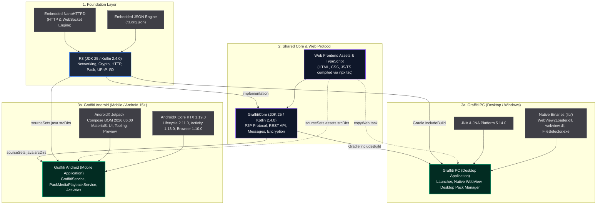

### What is Graffiti?

**Graffiti** is a secure, serverless, peer-to-peer (P2P) messaging application designed for absolute privacy and digital sovereignty. Unlike typical chat apps (such as WhatsApp, Telegram, or Discord) that route messages through central company servers, Graffiti connects you directly to other people.

Every text message and file shared on Graffiti is encrypted end-to-end (E2EE) on your device before it ever leaves. It is stored on your local disk, keeping you in complete control of your data.

------

### Key Features from a User's Perspective

- **True Peer-to-Peer Connections:** You can stat a local server port with one click, allowing nearby users to discover your node automatically or connect to you directly using your IP address and port.
- **End-to-End Encryption by Default:** Graffiti uses cryptographic keys (public/private key pairs) for identities. Only the specific recipient you select can decrypt and read your messages.
- **Deterministic Identities:** You can generate and recover your cryptographic profiles using a simple seed phrase. You can manage multiple identities simultaneously (e.g., separate profiles for different topics, forums, or personas).
- **Store-and-Forward Relays:** If you want to communicate with someone who isn't online at the same time as you, you can connect to a shared **Relay**. The relay securely caches the encrypted message (which the relay cannot read) and delivers it to your peer when they log on and sync.
- **Local Discovery:** Graffiti automatically scans your local network using multicast discovery, making it easy to find and chat with other users on the same Wi-Fi network without configuring anything.
- **Granular Storage Control:** Because your messages are stored locally on your device, Graffiti gives you full transparency over your storage. You can set strict storage quotas (in MB), see exactly how much space is being used, and purge cached storage instantly.

------

### Why You Would Want to Use Graffiti

1. **Absolute Privacy & Censorship Resistance** Since there is no central database or corporation running Graffiti, there is no one tracking your metadata, harvesting your contacts, or analyzing your communication patterns. There are no servers to be shut down or blocked by external entities.
2. **Offline & Local Mesh Communication** If the internet goes down, you can still communicate. Because Graffiti can discover and connect to peers over local Wi-Fi or LAN networks automatically, it is perfect for local mesh communication in emergencies, remote areas, or offline events.
3. **Total Control of Your Digital Footprint** With Graffiti, you decide exactly how long messages are stored on your device and how much storage space they can take. You can export or delete your identities and peer keys at any time, leaving no digital trace on the web.
4. **Asynchronous P2P Messaging** Pure P2P networks usually require both users to be online at the same time to chat. Graffiti solves this with secure, zero-knowledge Relays—allowing you to drop off encrypted notes for friends that they can pick up when they connect, without compromising privacy.

Graffiti is written in Kotlin and Java and is currently tested on Windows and Android. It can theoretically run on any JVM capable OS and on Android.

### Download:

- [Windows](https://www.res0nance.cc/graffiti/graffiti.zip)
- [Android](https://www.res0nance.cc/graffiti/graffiti.apk)

### Documentation

[How to use Graffiti](https://www.res0nance.cc/graffiti/graffiti-doc.html)

---

### Architectural Hierarchy Diagram



---

### Detailed Dependency Hierarchy

#### 1. Foundation: R3

`R3` is the base layer providing networking primitives, cryptography, content handling, UPnP port mapping, and lightweight HTTP/WebSocket serving.

* **Embedded/Vendorized Packages**:
  * `org.nanohttpd.*`: Lightweight HTTP server & WebSocket engine R3/src/main/kotlin/r3/http/WebServer.kt
  * `r3.org.json.*`: JSON parser and object serialization.
* **Core Subsystems Provided**:
  * `r3.net`: Socket, IP discovery, and JSON communication.
  * `r3.http`: Request routing, captive portal, range requests, file and resource handlers.
  * `r3.pack`: Pack file format packaging, hashing, and streaming.
  * `r3.encryption` & `r3.pke`: Asymmetric and symmetric cryptography (AES, RSA, ECC).
  * `r3.upnp`: UPnP Gateway discovery and NAT port mapping.

---

#### 2. Shared Protocol & Web UI: GraffitiCore

`GraffitiCore` implements the P2P networking protocols, the REST/HTTP API layer, and houses the cross-platform Web application assets.

* **Web UI & Build Tooling**:
  * Built with TypeScript (ES2022 output) via Gradle task `compileTypescript` (`npx tsc`).
* **Core Subsystems Provided**:
  * `r3.graffiti.GraffitiP2P`: Mesh peer discovery, ping/pong, challenge-response, content synchronization.
  * `r3.graffiti.GraffitiAPI`: HTTP/JSON REST API serving peer status, identity, messages, and storage.
  * `r3.graffiti.*`: Message types (`ChallengeMessage`, `ContentRequestMessage`, `EncryptedContentMessage`, etc.).

---

#### 3. Desktop Application: Graffiti

A standalone Windows desktop application packaged as an app-image using `jpackage`.

* **External Maven Dependencies**:
  * `net.java.dev.jna:jna:5.14.0` (Java Native Access)
  * `net.java.dev.jna:jna-platform:5.14.0` (Windows Win32 platform bindings)
* **Native Binaries & Bundled Libraries** Graffiti/lib:
  * `WebView2Loader.dll`: Microsoft Edge WebView2 runtime loader.
  * `webview.dll`: Native C/C++ WebView wrapper.
  * `FileSelector.exe`: Native Windows file picker helper.
  * `jna-5.18.1.jar` and `jna-platform-5.18.1.jar`: Bundled local JNA fallback jars.
* **Asset Integration**:
  * Gradle task `copyWeb` copies `../GraffitiCore/src/main/resources/web` into `build/libs/web` so the embedded local server can serve it to WebView2.

---

#### 4. Mobile Application: Graffiti
An Android application (minSdk 35, targetSdk 37, compileSdk 37) utilizing Jetpack Compose and foreground services.

* **Linkage to `R3` and `GraffitiCore`**:
  Instead of Gradle composite builds or JAR artifacts, the Android project **directly compiles the Kotlin source trees and mounts the web assets**:
  ```kotlin
  sourceSets {
      getByName("main") {
          java.srcDirs(
              file("src/main/java"),
              file("~/IdeaProjects/GraffitiCore/src/main/kotlin"),
              file("~/IdeaProjects/R3/src/main/kotlin")
          )
          assets.srcDirs(
              file("src/main/assets"),
              file("~/IdeaProjects/GraffitiCore/src/main/resources/web")
          )
      }
  }
  ```
* **External Maven / Jetpack Dependencies**
  * **AndroidX & Architecture**:
    * `androidx.core:core-ktx:1.19.0`
    * `androidx.lifecycle:lifecycle-runtime-ktx:2.11.0`
    * `androidx.activity:activity-compose:1.13.0`
    * `androidx.browser:browser:1.10.0` (Custom Tabs)
  * **Jetpack Compose UI (via BOM `2026.06.00`)**:
    * `androidx.compose.ui:ui`
    * `androidx.compose.ui:ui-graphics`
    * `androidx.compose.material3:material3`
    * `androidx.compose.ui:ui-tooling-preview` / `ui-tooling`
  * **Testing**:
    * `junit:junit:4.13.2`
    * `androidx.test.ext:junit:1.3.0`
    * `androidx.test.espresso:espresso-core:3.7.0`
    * `androidx.compose.ui:ui-test-junit4`
* **Android-Specific Subsystems**:
  * Graffiti/app/src/main/java/r3/graffiti/GraffitiService.kt: Foreground service keeping `GraffitiP2P` and local `WebServer` alive with WiFi locks and notification management.
  * Graffiti/app/src/main/java/r3/graffiti/PackMediaPlaybackService.kt: Background playback service for streaming pack media.
  * Graffiti/app/src/main/java/r3/graffiti/WebViewActivity.kt: Fullscreen WebView rendering `index.html` from assets.
  * Graffiti/app/src/main/java/r3/graffiti/PackViewActivity.kt): Native Compose UI for inspecting and downloading packs.
  * Graffiti/app/src/main/java/r3/graffiti/UriSource.kt: Android Storage Access Framework (SAF) adapter for R3 streaming.

